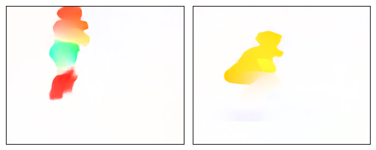
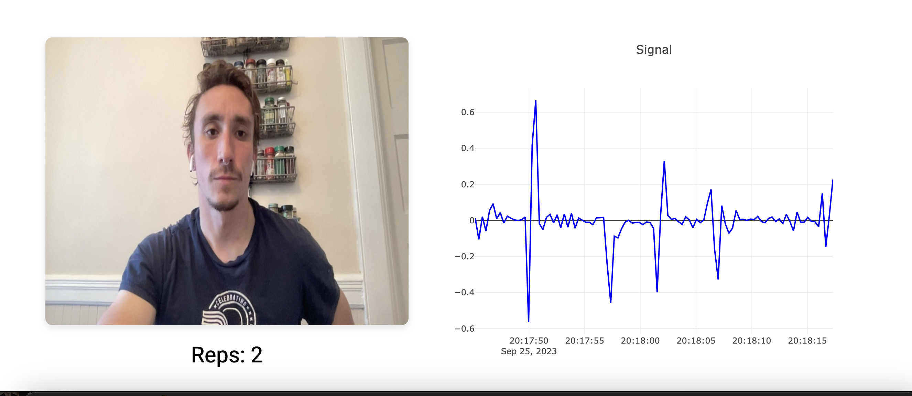

# Exercise Movement Analysis using Dense Optical Flows

- This project aims to analyze exercise movements using dense optical flows calculated with the RAFT and Farneback algorithms. The analysis includes the development of motion trajectories, calculation of repetitions, and estimation of velocity and force responses.

- 

- 

- [First Demo](https://drive.google.com/file/d/1ixlRtpTq7VOQ8FmZCbVMSRtGUT5RS7eF/view)

## Inspirations for the project:
- https://inria.hal.science/hal-00803241/file/IJCV.pdf
- https://arxiv.org/abs/2003.12039

## Project Outline
- **Dense Optical Flow Calculation:** Utilizes the RAFT and Farneback algorithms to calculate dense optical flows for exercise movements. ✅
- **Motion Trajectories:** Develops motion trajectories from the calculated optical flows ✅
- **Repetition Calculation:** Uses the periodicity of motion trajectories and the color of flows to calculate repetitions ✅
- **Velocity Estimation:** Attempts to calculate velocity with respect to the dimensions of the video using a combination of optical flows and keypoints, and cuboid coordinates.
- **Force Response Estimation:** Uses the Force-velocity relationship to predict force responses.
- **Fatigue Prediction:** Estimates fatigue of resistance training based on the calculated force responses.
  

### Initial Rep Counting Prototype
- The initial prototype can correctly calculate repetitions performed based on a modified Dense Optical Flow approach published by Wang et al., 2013. At a high level the approach
- Utilizes the OpenCV Farneback Dense Optical Flow to estimate movement of pixels from frame to frame
- Overlays a grid of keypoints over the image to downsample the frames
- Adds the dense optical flow calculations for each pixel to the closest keypoint to estimate movement within the area
- Averages all keypoint vectors in both the X and Y direction for the entire image turning the keypoint trajectories into a processable signal
- Uses a Exponential Moving Average (EMA) and high pass filter to clean the signal
- Uses scipy.find_peaks to get both the concentric and eccentric peaks for the movement (upward and downward motion)
- Interpretes these signal peaks as completed repetitions

### Issues
- In the absence of movement the approach will erroneously create peaks (count repetitions) until a larger movement is detected.
- Only processing signal in Y direction initially so counting is focused on vertical movements
- Farneback Algorithim is prone to noise
- Slight delay in rendering repetitions to browser
  
  

